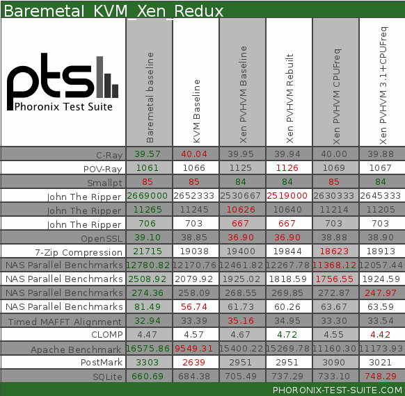

Research.md

**Kevin**  
1. What are the core abstractions that the system aims to provide? How and why do they depart from other systems?  
- Hypotheses  
  - Xen abstracts most of computer resources, including memory and cpu. Each domain on virtual machine can use these resources via dom0.
  - Xen aims to provide strong isolation that is performative. They use "paravirtualization" to do this. This is where virtual machine abstractions that are very similar to the actual hardware are used. The OS is required to be modified a bit still under this approach. It is important to note that this provides a large performance improvement over full virtualization yet still allows for the isolation. Xen also allows binaries to go unmodified for compatibility. Paravirtualization also allows Xen to expose real machine addresses to the guest OSes, notably supporting superpages and page coloring. domU virtual machines can assume safety via hardware-based isolation
- Research & Source Code Examples
  - Live Migration - one of the most interesting hypervisor capabilities - by calling `xl migrate <domain> <host>`, we can move a running VM to another Xen-driven host with “no noticeable downtime”  
    - `main_migrate`, defined in `tools/xl/xl_migrate.c`   
    - The documentation says a persistent shared storage that both dom0’s can access (like network storage) - Alternatively, Network Block Device (NBD) in the Xen Storage Management system can be used to share the VM harddrive  
    - Migrate - The system forks, creates the required send and recv file descriptors to communicate with the destination,  suspends and renames the source domain, and finishes once the success message from the other host is heard  
    - Migrate Receive (source dom0) - Initialize a domU object and allocate memory, create the domain
  - Para Virtualization (PV) - a major component of Xen which is very lightweight and does not require special hardware virtualization extensions (which is great for legacy HW)  
    - The PV API is referenced with the `_pv` suffix, especially in the `tools/libs/guest` directory.  
    - In the main dom0 code, the code is abstracted to check between HVM and PV code segments. This is done similar to how Linux polymorphism is implemented  
        // xg_sr_restore.c     
        ctx.restore.ops = ctx.dominfo.hvm
            ? restore_ops_x86_hvm : restore_ops_x86_pv;

        // xg_sr_restore_x86_pv.c  
        struct xc_sr_restore_ops restore_ops_x86_pv =  
        {  
              .pfn_is_valid    = x86_pv_pfn_is_valid,  
              .pfn_to_gfn      = pfn_to_mfn,  
        …  
        }  
    - As seen in the picture below, PV VMs are able to connect (through dom0) directly to hardware devices. Using HVMs, each call hits the virtualized CPU, memory, etc at the hypervisor layer. PV sees a performance boost by not requiring persistent driver emulation.

  - The Xen team (University of Cambridge) invented Paravirtualization as an efficient alternative to emulated hardware. Unfortunately, not many operating systems and their drivers are built to support paravirtualization. However, Xen and Linux are uniquely coupled for this goal. 

**Gus**  
***In what conditions is the performance of the system "good" and in which is it "bad"? How does its performance compare to a Linux baseline (this discussion can be quantitative or qualitative)?***

Here we can see that xen scales with Network Interface cards for a while, however the differences show eventually

The above comparison to baseline comes from the paper Xen and the Art of Virtualization
Compared to baseline, xen never is better. However, xen beats other virtualization methods in every case

Here, we can see that the xen matches perfirmance well after adding more than one instance. This makes some intuitive sense, since Xen is designed for use cases where many more than a single vm is running

This diagram shows a good representation of when KVM yielded better results vs when Xen did. Proxmox was also a part of the comparison. This comes from the paper Performance Evaluation of Xen, KVM, and Proxmox Hypervisors. This shows that Xen is better with filesystem performance and application performance. And those two results make sense since that is the motivation behind Xen. Xen has more direct access to devices, and enforces isolation. Further, xen is targeted at use cases that utilize many vms. In some papers they even state that they target 100 vms and if fewer are needed there might be better solutions elsewhere. Each of the performance tests in this paper do not approach that many. 

***What are the "modules" of the system (see early lectures), and how do they relate? Where are isolation boundaries present? How do the modules communicate with each other? What performance implications does this structure have?***

In the diagram above, we can see that the high level modules are the hypervisor (xen), the Guest VM that acts as control plane software, and the guest vms that are labeled user software. The "user software" vms are the vms that most users would access. For example, the "user" vm could be an AWS EC2 instance. These are the instances that have the strongest isolation between each other.

**Emil**  
What are the core technologies involved, and how are they composed?

The system consists of two big layers: Hypervisor at the low layer and Domains (guest VMs) on top of that. Hypervisor modules are the Scheduler, MMU, Timers and Interrupts, whereas Domains typically are the Guest OS, except the very first special Domain (Dom0) that contains drivers for all the devices (native and virtual) in the system. Isolation boundaries are present on the Domain layer, where all Domains are isolated from each other, except for the Dom0 that domains can interact with throughout their lifetime. Having Dom0 cases slower startup times and increases complexity (need for various Xen tools.
Linux VM (Dom0) is utilized to provide management services throughout the machine's execution. Hardware virtualization (when not doing paravirtualization) via the machine architecture is used.
In Dom0 there are two drivers for supporting networking requests and local dist requests from DomU PV and HVM Guests: 
the Network Backend Driver (NBD)
the Block Backend Driver (BBD)
The NBD communicates directly with the local networking hardware to process all VMs requests coming from the DomU guests. The BBD communicates with the local storage disk to read and write data from the drive based upon DomU requests.
In DomU the PV Guest VM is aware that it does not have direct access to the hardware and hence it can recognize that other VMs are probably running on the same machine. Similar to Dom0, a DomU PV Guest also contains two drivers for network and disk access: PV Network Driver and PV Block Driver.
However, the DomU HVM Guest VM is not aware that it is sharing processing time on the hardware and that other VMs are present. A DomU HVM Guest does not have the PV drivers located within the VM (unlike PV guests). Instead a special daemon is started for each HVM Guest in Dom0, Qemu-DM. Qemu-DM supports the Dom U HVM Guest for networking and disk access requests.

	Some other technologies involved in Xen are the following:
Xend daemon is a python application that is considered the system manager for the Xen environment. It leverages the libxenctrl library (see below) to make requests of the Xen hypervisor. All requests processed by the Xend are delivered to it via an XML RPC interface by the Xm (see below) tool:
Xm is the command line tool that takes user input and passes to Xend via XML RPC.
Libxenctrl is a C library that provides Xend the ability to talk with the Xen hypervisor via Dom0. A special driver within Dom0 delivers the request to the hypervisor.
		
Qemu-DM - Every HVM Guest running on a Xen environment requires its own Qemu daemon. This tool handles all networking and disk requests from the DomU HVM Guest to allow for a fully virtualized machine in the Xen environment. Qemu must exist outside the Xen hypervisor due to its need for access to networking and I/O and is therefore found in Dom0.
Xen Virtual Firmware is a virtual BIOS that is inserted into every DomU HVM Guest to ensure that the operating system receives all the standard start-up instructions it expects during normal boot-up providing a standard PC-compatible software environment.
Xen PCI Passthrough is a new feature in Xen designed to improve overall performance and reduce the load on the Dom0 Guest. This technique allows the DomU Guest to have direct access to local hardware without using the Dom0 for hardware access. The DomU Guest is given rights to talk directly to a specific hardware device instead of the previous method of using Frontend and Backend drivers. The diagram below shows how this feature works:

References:    
Unikernels: Library Operating Systems for the Cloud 
Xen and the Art of Virtualization
Virtualization in Xen 3.0

Aki
What are the security properties of the system? How does it adhere to the principles for secure system design? What is the reference monitor in the system, and how does it provide complete mediation, tamperproof-ness, and how does it argue trustworthiness?

(Hypothesis)
By thorough control via dom0, xen can monitor every activity. Also, since each domain is separated, isolated well.(a)
One recent optimization is the dom0-less static partitioning to avoid the complexity of running an extra management virtual machine after bootup. (k)
Also, if dom0 is used, there is the option for xen PCI passthrough, which gives the VM guest more rights - instead of sending requests to the event channel via dom0, the privileged domU can bypass the access the hardware directly (much faster but less secure (k)

<Answer of those questions>
Now, just write down the key points of xen from references.
Until final report, I will connect each features and each code property.

Reference monitor
XSM (Xen Security Module) in Xen
This is a module which enable an administrator or developer to exert fin-grained control over a Xen domain and its capabilities.
Specifically, XSM makes it possible to define permissible interactions between domains, the hypervisor itself, and related resources such as memory and devices.
Scope includes dom0 Linux and user-level

Mediation
XSM to control VMM operation
Security ENriched LInux (SELinux) in dom0; use network to communicate

Tamperproof
Xen has a much larger TCB, and more flexible

Verification
Xode - 200k + LOC
Policy - SELinux style

<Key source cord>
xen/xen/xsm/flask/ss/policydb.h
xen/xen/xsm/flask/ss/policydb.c
Policy: types, roles, users and attributes
Permission tables
xen/tools/flask/policy/modules/xen.te
Policy descriptions

(references)
Advanced Systems Security:Virtual Machine System, http://www.cse.psu.edu/~trj1/cse544-f15/slides/cse544-vmm.pdf
Xen Security Modules : XSM-FLASK https://wiki.xenproject.org/wiki/Xen_Security_Modules_:_XSM-FLASK
Breaking Up is Hard to Do: Security and Functionality in a Commodity Hypervisor https://www.cs.ubc.ca/~andy/papers/xoar-sosp-final.pdf
Verifying the Safety of Xen Security Modules 

Vedant

What is the target domain of the system? Where is it valuable, and where is it not a good fit? These are all implemented in an engineering domain, thus are the product of trade-offs. No system solves all problems (despite the claims of marketing material).

Xen Project runs in a more privileged CPU state than any other software on the machine.
Responsibilities of the hypervisor include memory management and CPU scheduling of all virtual machines ("domains"), and for launching the most privileged domain ("dom0") - the only virtual machine which by default has direct access to hardware. From the dom0 the hypervisor can be managed and unprivileged domains ("domU") can be launched.[3]
The dom0 domain is typically a version of Linux or BSD. User domains may either be traditional operating systems, such as Microsoft Windows under which privileged instructions are provided by hardware virtualization instructions (if the host processor supports x86 virtualization, e.g., Intel VT-x and AMD-V), or paravirtualized operating systems whereby the operating system is aware that it is running inside a virtual machine, and so makes hypercalls directly, rather than issuing privileged instructions.
Xen Project boots from a bootloader such as GNU GRUB, and then usually loads a paravirtualized host operating system into the host domain (dom0).

Uses: [Where it’s valuable]
Internet hosting service companies use hypervisors to provide virtual private servers. Amazon EC2 (since August 2006), IBM SoftLayer, Liquid Web, Fujitsu Global Cloud Platform, Linode, OrionVM and Rackspace Clouduse Xen as the primary VM hypervisor for their product offerings.[52]
Virtual machine monitors (also known as hypervisors) also often operate on mainframes and large servers running IBM, HP, and other systems. Server virtualization can provide benefits such as:
Consolidation leading to increased utilization
Rapid provisioning
Dynamic fault tolerance against software failures (through rapid bootstrapping or rebooting)
Hardware fault tolerance (through migration of a virtual machine to different hardware)
Secure separations of virtual operating systems
Support for legacy software as well as new OS instances on the same computer
Xen's support for virtual machine live migration from one host to another allows load balancing and the avoidance of downtime.
Virtualization also has benefits when working on development (including the development of operating systems): running the new system as a guest avoids the need to reboot the physical computer whenever a bug occurs. Sandboxed guest systems can also help in computer-security research, allowing study of the effects of some virus or worm without the possibility of compromising the host system.
Finally, hardware appliance vendors may decide to ship their appliance running several guest systems, so as to be able to execute various pieces of software that require different operating systems.

[Where it’s not a good fit]

Unfortunately, one of the most widely-used hypervisors, Xen is highly susceptible to attack because it employs a monolithic design (a single point of failure) and com- prises a complex set of growing functionality including VM management, scheduling, instruction emulation, IPC (event channels), and memory management. As Xen’s functionality has increased so too has its code base, rising from 45K lines-of-code (LoC) in v2.0 to 270K LoC in v4.0. Such a large code base inevitably leads to a large number of bugs that become security vulnerabilities. Attackers can easily exploit a known hypervisor vulnerability to “jail break” from a guest VM to the hypervisor to gain full control of the system. For example, a privilege escalation caused by non- canonical address handling (in a hypercall) can lead to an attacker gaining control of Xen, undermining all security in multi-tenant cloud environments.
Research Paper: https://www.trustkernel.com/uploads/pubs/nx.pdf
https://link.springer.com/content/pdf/10.1007/978-3-540-78474-6_23.pdf
https://dl.acm.org/doi/pdf/10.1145/1346256.1346259?casa_token=EEidqpPOJ3QAAAAA:S4NWWNXZ8Lee6ZSrqWU6TPF9PFOJXHpI6Bgt3YoACALvtG_zo0on5A-XPGKEUJKNd1G99LUmPRPe2Q

Biyas

Q) What optimizations exist in the system? What are the "key operations" that the system treats as a fast-path that deserve optimization? How does it go about optimizing them?

We can breakdown the optimizations in the system by components.

- Event Channels
Events are how Xen notifies the VMs and event channel is a primitive provided by Xen for event notifications. Events are stored as bitmap which is shared between VMs and Xen. Optimizations such as N-Level search path and per-cpu mask are used to speed up the search process. So far Xen supports 2-level event channel and 3-level is planned for their latest 4.3 version.
2-level event channel is where the first level is pending event bits which basically means what kind of event is pending and the second level is a bitset of pending events themselves.

- Buffered IO Ring  
Ring data structure is an implementation of queue data structure and uses pointers for Enqueue and Dequeue. In Xen, guest VMs attach a unique Id for each request that goes into the ring and Xen after processing the request reproduces the id when placing it on the ring for consumption by guest VMs. This optimization allows Xen to reorder requests in order of priority or scheduling
considerations which is useful when dealing with disk requests.
Another optimization that exists where Xen decouples the production of requests or responses from the notification of the other party. It is very similar to batching where a domain can defer delivery of a notification by specifying a threshold of number of responses or in the case of requests, a domain may enqueue multiple entries before invoking a hypercall to alert
Xen. This allows each domain to trade-off latency and throughput requirements.

- Network   
Xen implements zero copy networking where it requires Guest OS to exchange unused page frame for each packet it receives to avoid copying the packet between Xen and guest OS.

- Scheduler   
Xen uses Borrowed Virtual Time scheduling algorithm. BVT provides low-latency dispatch by using virtual-time warping, a mechanism which temporarily violates ‘ideal’ fair sharing to favor recently-woken domains. 

- Virtual address translation  
Xen does not require the use of shadow page tables which is required in full virtualization.
Xen maps guest OS page tables directly with the memory and then make it Read only. All page table updates are passed to Xen for validation via hypercall. A small optimization here exists where guest OS can queue multiple updates locally before making a hypercall. Because most of the times guest OS will be reading from page tables, it has very little performance overhead.   

- Disk  
Reordering of requests happen at two places. Once inside the domain by the disk scheduling algorithm inside it beforequeueing them on the ring and the second time inside Xen as it has more knowledge about the actual disk layout. So responsesfrom Xen can also be out of order as we have already mentioned above when discussing the ring data structure. Domains can also explicitly pass down reorder barriers to prevent reordering if order is necessary to maintain higher level semantics.
Xen uses round robin algorithm to process competing disk requests and then it's passed to a elevator scheduler before reaching the disk hardware.

Research papers used
- [Event Channel Internals](https://wiki.xenproject.org/wiki/Event_Channel_Internals)
- [Xen and the Art of Virtualization](https://www.cl.cam.ac.uk/research/srg/netos/papers/2003-xensosp.pdf)

(Maybe this question can be discussed at the final step?)
Subjective: What do you like, and what don't you like about the system? What could be done better were you to re-design it?